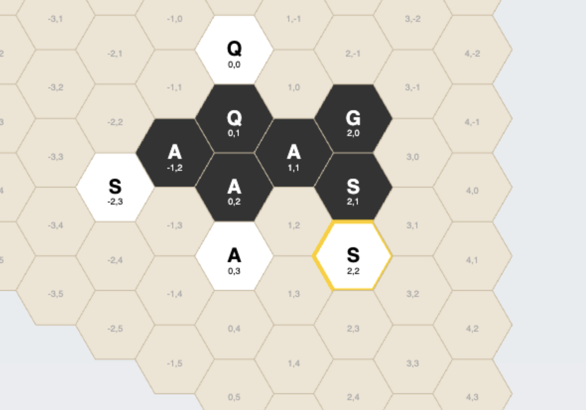

# BUG-OF-WAR

A 2D turn-based strategy game inspired by "Hive".

## Prerequisites

* **Go Version 1.26.1**

## Getting Started

1. **Install Dependencies:**
   Run the following command to download and tidy up project dependencies:
   ```bash
   go mod tidy
   ```

2. **Run the Server:**
   ```bash
   go run .
   ```

3. **Access the Game:**
   Open your browser and navigate to:
   [http://localhost:8080](http://localhost:8080)

## Testing

To run the full suite of Go unit tests:
```bash
go test -v .
```

## Spider Movement: Exactly 3 Steps
One of the most unique pieces is the **Spider**. 

Unlike the Ant (which can move any distance), the Spider moves **exactly 3 steps** per turn. To prevent "wiggling" back and forth to use up steps, our implementation follows the **shortest perimeter path** rule. This means a Spider cannot end its move on a hex it could have reached in fewer than 3 steps.

### Path Comparison:
In the image below, the selected White Spider at `(2,2)` is looking to move around the hive.

*   **Path to (-1,4) [VALID]:** 
    1.  (2,2) ➔ (1,3)
    2.  (1,3) ➔ (0,4)
    3.  (0,4) ➔ **(-1,4)** (Exactly 3 steps)
*   **Path to (0,4) [INVALID]:**
    While it is *technically* possible to reach `(0,4)` in 3 steps (e.g., `(2,2) -> (1,2) -> (1,3) -> (0,4)`), it is **invalid** because the hex is also reachable in only **2 steps** (`(2,2) -> (1,3) -> (0,4)`). In Hive, the Spider must take the most direct path around the perimeter; if a destination is reachable in 1 or 2 steps, it is not a valid 3-step destination.



## Roadmap
[x] Hex Grid & Canvas Rendering
[x] Initial game state & piece types
[x] Placement Interaction & Rules
[x] Movement & Win Conditions (One Hive rule, all piece patterns)
[ ] Testing & Refactoring
[ ] WebSocket infrastructure (Real-time multiplayer)
[ ] Add license
